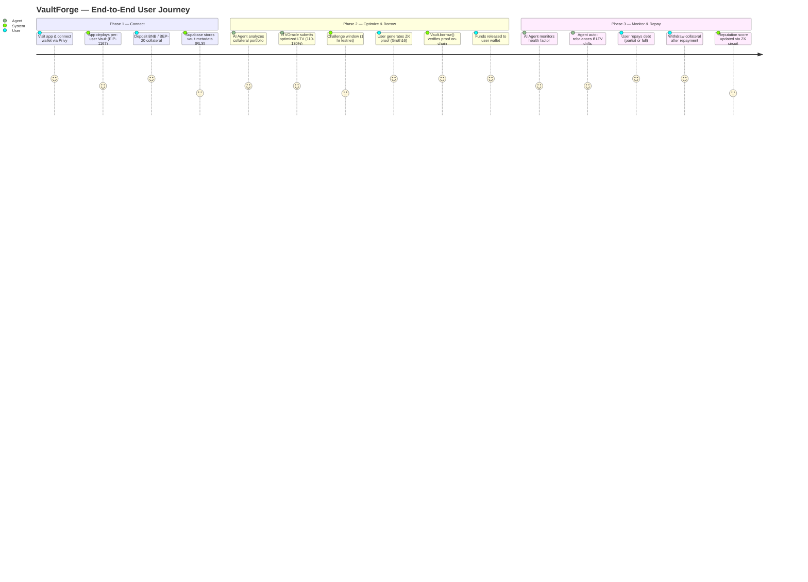
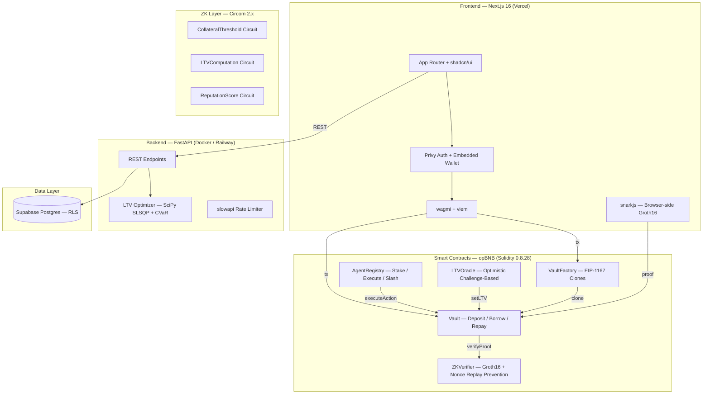

# VaultForge 🔐

> **Non-Custodial ZK-Private Programmable Intelligent Collateral Vaults**
> for Trust-Minimized Web3 Credit & BNPL on BNB Chain

**[Live Demo](https://vaultforge-nu.vercel.app)** |
**[opBNBScan Contracts](https://opbnb-testnet.bscscan.com)** |
**[Documentation](./docs/PROJECT.md)**

> Built for **BNB Chain × YZi Labs Hackathon** — Smart Collateral Track

---

## The Problem (Data-Backed)

Over **$1.2 trillion** in crypto assets sit idle in wallets, earning nothing — their owners unable to access credit without liquidation risk or identity exposure. Leading DeFi protocols like Venus and Aave demand **150%+ overcollateralization**, locking up 50% more capital than the loan is worth, while every position is visible on-chain — doxxing balances, strategies, and liquidation levels to MEV bots and competitors. Meanwhile, **Buy Now Pay Later** in TradFi sees **40%+ default rates** among underbanked users because credit scoring relies on centralized identity, not on-chain behavior. Crypto holders deserve private, capital-efficient borrowing powered by their real blockchain reputation.

---

## Our Solution

VaultForge is a **non-custodial vault system** where users deposit collateral into per-user smart contracts on opBNB, generate **Groth16 zero-knowledge proofs** to borrow without revealing balances or positions publicly, and rely on **BNB AI agents** to dynamically optimize their Loan-to-Value ratio from the typical 150% down to **110–130%** — freeing locked capital. The result: cheaper borrowing, full privacy, algorithmic risk management, and an intent-based BNPL layer — all settled on BNB Chain's fastest L2.

---

## Why VaultForge Stands Out

| Feature | Venus / Aave | VaultForge |
|---|---|---|
| **Collateral Privacy** | ❌ Public on-chain | ✅ ZK-Private (Groth16) |
| **LTV Ratio** | Static 150%+ | Dynamic 110–130% (AI-optimized) |
| **Active Management** | ❌ None | ✅ BNB AI Agents (auto-rebalance) |
| **Custody** | ❌ Pool-based (custodial risk) | ✅ Per-user non-custodial vaults |
| **Credit Scoring** | ❌ None | ✅ ZK reputation proofs |
| **BNPL** | ❌ Not supported | ✅ Intent-based installments |
| **Seizure Protection** | ❌ Full liquidation | ✅ Partial seizure only (max 50%) |

---

## User Journey



---

## System Architecture



---

## Tech Stack

| Layer | Technology | Why |
|---|---|---|
| **L2 Network** | opBNB (Chain ID 5611) | Lowest fees on BNB ecosystem, <1s finality |
| **Smart Contracts** | Solidity 0.8.28 + Foundry | Type-safe, fuzz-testable, fast compilation |
| **Contract Patterns** | OpenZeppelin v5 (Clones, ReentrancyGuard) | Audited, gas-efficient minimal proxies |
| **ZK Proofs** | Circom 2.x + snarkjs (Groth16) | Constant-size proofs, cheap on-chain verification |
| **Frontend** | Next.js 16 + React 19 + TypeScript 5 | App Router, React Compiler, server components |
| **Wallet Auth** | Privy + wagmi 3.5 + viem 2.46 | Embedded wallets, social login, gasless UX |
| **Styling** | Tailwind CSS v4 + shadcn/ui | Utility-first, cyber-minimal dark theme |
| **Backend API** | FastAPI + Python 3.12 + UV | Async, auto-docs, dependency injection |
| **Optimization** | SciPy (SLSQP + CVaR) | Portfolio-based LTV optimization |
| **Database** | Supabase Postgres + RLS | Row-level security, real-time subscriptions |
| **CI/CD** | GitHub Actions (5 workflows) | Test + deploy contracts, backend, frontend |
| **Containerization** | Docker Compose | One-command full stack for judges |

---

## Quick Start (3 Commands)

```bash
# 1. Clone and configure
git clone https://github.com/blinderchief/VaultForge.git && cd VaultForge
cp .env.example .env   # Fill in your keys (see Environment Variables below)

# 2. Launch the entire stack
docker compose up --build

# 3. Open the app
# Frontend → http://localhost:3000
# Backend  → http://localhost:8000/docs (Swagger UI)
```

All 4 services start automatically: **Postgres** (`:5432`) → **Redis** (`:6379`) → **Backend** (`:8000`) → **Frontend** (`:3000`), with health checks and dependency ordering.

### Run Without Docker

```bash
# Contracts
cd contracts && forge build && forge test   # 53 tests

# Backend
cd backend && uv sync && uv run pytest      # 41 tests
uv run uvicorn app.main:app --reload --port 8000

# Frontend
cd frontend && npm install && npm run dev   # http://localhost:3000

# ZK Circuits
cd zk-circuits && npm install && bash scripts/compile.sh
```

---

## Environment Variables

Copy `.env.example` → `.env` and fill in your values. **Never commit `.env`.**

| Variable | Description | Example |
|---|---|---|
| `OPBNB_TESTNET_RPC_URL` | opBNB Testnet JSON-RPC endpoint | `https://opbnb-testnet-rpc.bnbchain.org` |
| `BSC_TESTNET_RPC_URL` | BSC Testnet RPC for cross-chain reads | `https://data-seed-prebsc-1-s1.bnbchain.org:8545` |
| `DEPLOYER_PRIVATE_KEY` | Deployer wallet key (Foundry scripts) | `0xabc...` (never share) |
| `ETHERSCAN_API_KEY` | opBNBScan / BSCScan verification key | `YN4PT4...` |
| `NEXT_PUBLIC_VAULT_FACTORY_ADDRESS` | Deployed VaultFactory address | `0xb881fAf4e552780f65Ae8FC1053AD46134b71173` |
| `NEXT_PUBLIC_VAULT_IMPL_ADDRESS` | Vault implementation address | `0x45095a5b07Cd7231c4f1B12837b427a9a94AF1C0` |
| `NEXT_PUBLIC_ZK_VERIFIER_ADDRESS` | Deployed ZKVerifier address | `0x2925896cABAd4c6B7c505495948F79b3e9308C54` |
| `NEXT_PUBLIC_AGENT_REGISTRY_ADDRESS` | Deployed AgentRegistry address | `0xFB9D6eFE47a4b6175025C9Cd97b776B7e8d9916b` |
| `NEXT_PUBLIC_LTV_ORACLE_ADDRESS` | Deployed LTVOracle address | `0x953386f1309b2BdA061d895aBddB17b9Db706744` |
| `NEXT_PUBLIC_PRIVY_APP_ID` | Privy App ID for wallet auth | `cmm4pm...` |
| `NEXT_PUBLIC_SUPABASE_URL` | Supabase project URL | `https://xxx.supabase.co` |
| `NEXT_PUBLIC_SUPABASE_ANON_KEY` | Supabase public anon key (RLS enforced) | `eyJhbG...` |
| `SUPABASE_SERVICE_ROLE_KEY` | Supabase service key (backend only) | `eyJhbG...` |
| `NEXT_PUBLIC_BACKEND_URL` | Backend URL exposed to browser | `http://localhost:8000` |
| `NEXT_PUBLIC_CHAIN_ID` | Target chain ID | `5611` |
| `CORS_ORIGINS` | Allowed CORS origins (comma-separated) | `http://localhost:3000` |
| `ZERION_API_KEY` | Zerion API key for portfolio data | `zk_...` |

---

## Verified Contracts (opBNB Testnet — Chain ID 5611)

All contracts deployed and verified on opBNB testnet. Source code viewable on opBNBScan.

| Contract | Address | opBNBScan | Verified |
|---|---|---|---|
| **VaultFactory** | `0xb881fAf4e552780f65Ae8FC1053AD46134b71173` | [View](https://opbnb-testnet.bscscan.com/address/0xb881fAf4e552780f65Ae8FC1053AD46134b71173) | ✅ |
| **Vault (Implementation)** | `0x45095a5b07Cd7231c4f1B12837b427a9a94AF1C0` | [View](https://opbnb-testnet.bscscan.com/address/0x45095a5b07Cd7231c4f1B12837b427a9a94AF1C0) | ✅ |
| **ZKVerifier** | `0x2925896cABAd4c6B7c505495948F79b3e9308C54` | [View](https://opbnb-testnet.bscscan.com/address/0x2925896cABAd4c6B7c505495948F79b3e9308C54) | ⏳ Pending |
| **AgentRegistry** | `0xFB9D6eFE47a4b6175025C9Cd97b776B7e8d9916b` | [View](https://opbnb-testnet.bscscan.com/address/0xFB9D6eFE47a4b6175025C9Cd97b776B7e8d9916b) | ✅ |
| **LTVOracle** | `0x953386f1309b2BdA061d895aBddB17b9Db706744` | [View](https://opbnb-testnet.bscscan.com/address/0x953386f1309b2BdA061d895aBddB17b9Db706744) | ✅ |
| **TestUSDC (tUSDC)** | `0x51795Ef0e9d2B37A89F077a2E2832ae4fd9764bE` | [View](https://opbnb-testnet.bscscan.com/address/0x51795Ef0e9d2B37A89F077a2E2832ae4fd9764bE) | — |

> **Deployer:** [`0x97950A98980a2Fc61ea7eb043bb7666845f77071`](https://opbnb-testnet.bscscan.com/address/0x97950A98980a2Fc61ea7eb043bb7666845f77071) — 7+ on-chain transactions
> **Deployment cost:** 3,688,663 gas total ≈ **$0.000004 USD** (opBNB L2 pricing)
> **Full deployment data:** [`contracts/deployments/testnet.json`](./contracts/deployments/testnet.json)

### On-Chain Activity (3 Vault Clones Deployed)

| Vault | Owner | Clone Address | Tx Hash |
|---|---|---|---|
| #1 | `0x9795...7071` | `0x5085...790c` | [`0x9764...0000`](https://opbnb-testnet.bscscan.com/tx/0x97649e2ab1fdde3f5e84173728d11459e6279eface9a53870a70a437066a0000) |
| #2 | `0x0000...0001` | `0xdcb4...8fa9` | [`0x6cf2...4473`](https://opbnb-testnet.bscscan.com/tx/0x6cf2bcbd1022880d638c54783ef412967bbc5a853fe5ea84b41dfc7220934473) |
| #3 | `0x0000...0002` | `0xd683...9bd0` | [`0x01f9...3284`](https://opbnb-testnet.bscscan.com/tx/0x01f97eb2afcc8e004cb15c25a73f4d27c1ee0bcd9cdfac3d1d879ab648563284) |

### Test Token (tUSDC)

**TestUSDC** (`tUSDC`) is an open-mint ERC-20 deployed for E2E testing. Anyone can mint tokens:

```bash
# Mint 10,000 tUSDC to any wallet
cast send 0x51795Ef0e9d2B37A89F077a2E2832ae4fd9764bE \
  "mint(address,uint256)" <WALLET_ADDRESS> 10000000000000000000000 \
  --rpc-url https://opbnb-testnet-rpc.bnbchain.org --private-key <KEY>
```

| Property | Value |
|---|---|
| **Address** | `0x51795Ef0e9d2B37A89F077a2E2832ae4fd9764bE` |
| **Symbol** | tUSDC |
| **Decimals** | 18 |
| **Mint** | Open — `mint(address to, uint256 amount)` |

---

## BNB Ecosystem Integration

VaultForge is built natively for the BNB ecosystem — not ported from Ethereum.

| Integration | How We Use It | Evidence |
|---|---|---|
| **opBNB L2** | All contracts deployed on opBNB testnet (chain 5611) | [Deployment tx](https://opbnb-testnet.bscscan.com/tx/0xe62c29acea683b5b015fe2529d5e58112d22c67e6c43c537c1cfd6706824e7b3) |
| **EIP-1167 Minimal Proxies** | VaultFactory deploys gas-efficient vault clones | Clone cost: 207,659 gas ≈ **$0.0000002 USD** |
| **BNB AI Agent Framework** | AgentRegistry.sol — agents stake tBNB, execute vault actions, earn fees, get slashed | [Contract](https://opbnb-testnet.bscscan.com/address/0xFB9D6eFE47a4b6175025C9Cd97b776B7e8d9916b) |
| **ZK Privacy (Groth16)** | ZKVerifier.sol — real on-chain proof verification with nonce replay prevention | [Contract](https://opbnb-testnet.bscscan.com/address/0x2925896cABAd4c6B7c505495948F79b3e9308C54) |
| **Optimistic Oracle** | LTVOracle.sol — off-chain optimizer submits LTV with 1h challenge window | [Contract](https://opbnb-testnet.bscscan.com/address/0x953386f1309b2BdA061d895aBddB17b9Db706744) |
| **opBNB Gas Efficiency** | Sub-cent operations: deploy vault $0.0000002, full contract suite $0.000004 | Gas price: 0.000000001 gwei |
| **Supabase (off-chain)** | Real-time vault health monitoring, RLS-enforced user data | [Backend API](./backend/) |

### Why opBNB?

- **Cost:** Full contract deployment costs < $0.00001. Individual vault operations < $0.001.
- **Speed:** ~1s block times for responsive UX.
- **BSC Bridge:** Vault collateral can accept BSC-bridged tokens (BTCB, ETH, USDT).
- **Native tBNB staking:** AgentRegistry uses native BNB for agent staking — no wrapped tokens.

---

## Smart Contracts

5 production contracts, **53 passing tests** (unit + integration + ZK verifier):

| Contract | Purpose | Key Features |
|---|---|---|
| **VaultFactory.sol** | Deploys per-user vaults | EIP-1167 minimal proxies, one vault per user |
| **Vault.sol** | Collateral custody + borrowing | ZK-gated borrow, partial seizure (max 50%), ReentrancyGuard |
| **ZKVerifier.sol** | Groth16 proof verification | Real Groth16 verifier, proof replay prevention (hash + per-vault nonce) |
| **AgentRegistry.sol** | AI agent staking + execution | 0.01 BNB min stake, fee distribution, admin slashing |
| **LTVOracle.sol** | Dynamic LTV optimization | Optimistic 1-hour challenge window, 10–90% LTV bounds |

### Security Invariants

- **Partial seizure only** — max 50% of any single token can be seized on default
- **ZK proof required** — every `borrow()` call verified on-chain via Groth16
- **Replay prevention** — proof hash + per-vault incrementing nonce
- **ReentrancyGuard** — on all state-changing functions across all contracts
- **Non-custodial** — each user has their own vault; no shared pool risk

---

## ZK Circuits

3 Circom 2.x circuits with Groth16 proving system:

| Circuit | Proves | Public Signals |
|---|---|---|
| **CollateralThreshold** | Vault collateral ≥ minimum threshold | threshold, result |
| **LTVComputation** | LTV ratio is correctly computed | collateral value, debt, LTV |
| **ReputationScore** | On-chain reputation meets minimum | score, threshold |

Proofs are generated **client-side in the browser** via snarkjs (WASM + zkey artifacts served from `/public/zk/`), verified on-chain by `ZKVerifier.sol`. Trusted setup uses `powersOfTau28_hez_final_14.ptau` (Hermez ceremony).

---

## Business Model & Token Economics

> **Full business model with market data, unit economics, competitive analysis, and GTM strategy:** [`docs/BUSINESS_MODEL.md`](./docs/BUSINESS_MODEL.md)

### Revenue Streams

| Stream | Fee | Description |
|---|---|---|
| **AI Agent Performance Fee** | 0.5% of yield | Charged on AI agent rebalancing profits |
| **BNPL Volume Fee** | 0.1% of loan volume | Taken on each BNPL installment transaction |
| **Premium Agent Subscriptions** | $9.99–49.99/mo | Advanced strategies, cross-chain vaults, priority execution |

### Year 1 Revenue Projection

With **$10M TVL** at **0.5% yield fee**: ~**$50,000/month** in performance fees alone, plus BNPL volume fees scaling with adoption. At $100M TVL (Phase 3 target): **$500,000/month**.

### $FORGE Token Utility

| Function | Description |
|---|---|
| **Agent Staking** | Stake $FORGE to register and run AI agents; earn execution fees |
| **Default Insurance Pool** | Stake $FORGE to back the insurance pool; earn premiums when loans repay |
| **Governance Voting** | Vote on protocol parameters: max LTV bounds, fee rates, new chains |
| **Fee Discounts** | Hold $FORGE for reduced BNPL fees and priority agent execution |

### Token Distribution

| Allocation | Percentage | Vesting |
|---|---|---|
| **Community & Agents** | 40% | Linear unlock over 3 years |
| **Core Team** | 20% | 4-year vesting, 1-year cliff |
| **Ecosystem Fund** | 20% | DAO-governed disbursement |
| **Initial Liquidity** | 10% | Unlocked at TGE for DEX pools |
| **Early Contributors** | 10% | 2-year vesting, 6-month cliff |

---

## Target Users

### Primary: "Alex" — Crypto-Native DeFi Power User

- Holds $50k–$500k in BNB, ETH, stablecoins across wallets
- Wants to borrow against holdings without selling or revealing positions
- Currently uses Venus/Aave but frustrated by 150% collateralization and public liquidation levels
- Values privacy, capital efficiency, and automated portfolio management
- Age 25–40, trades actively, understands ZK proofs conceptually

### Secondary Users

| Segment | Use Case |
|---|---|
| **DeFi Yield Farmers** | Leverage existing positions without liquidation risk |
| **NFT / GameFi Holders** | Borrow against illiquid assets with AI-appraised LTV |
| **DAOs / Treasuries** | Institutional non-custodial vaults with governance controls |
| **BNPL Shoppers** | Pay-later for on-chain purchases using collateral proofs |
| **AI Agent Operators** | Stake and run profitable rebalancing agents; earn fees |

---

## Roadmap

| Phase | Milestone | Timeline | Success Metrics |
|---|---|---|---|
| **Phase 1** — Hack MVP | opBNB testnet live | Feb 2026 | ✅ 5 contracts deployed, 3 ZK circuits proven, AI agent demo, 53 tests pass |
| **Phase 2** — Mainnet | Production launch | Q2 2026 | Audit complete (CertiK/Halborn), Venus integration, fiat on-ramps, 1,000 active users |
| **Phase 3** — Scale | Cross-chain expansion | Q4 2026 | Ethereum + Arbitrum + Polygon support, institutional vault templates, $100M TVL target |
| **Phase 4** — DAO | Decentralized governance | Q2 2027 | $FORGE fair launch, community governance live, 10+ chains supported, break-even on fees |

---

## Project Structure

```
VaultForge/
├── contracts/            Solidity 0.8.28 — Foundry (forge build, forge test)
│   ├── src/              5 production contracts (VaultFactory, Vault, ZKVerifier, AgentRegistry, LTVOracle)
│   ├── test/             53 tests (unit + integration + ZK verifier)
│   ├── script/           Deployment & verification scripts
│   └── deployments/      Deployed addresses and metadata (testnet.json)
├── zk-circuits/          Circom 2.x — 3 Groth16 circuits
│   ├── circuits/         .circom source files
│   ├── build/            Compiled circuit artifacts (R1CS, WASM, zkey)
│   └── ptau/             Powers of Tau ceremony file
├── backend/              FastAPI + Python 3.12 — UV package manager
│   ├── app/              API routes, SciPy optimizer, Supabase models
│   └── tests/            41 pytest tests
├── frontend/             Next.js 16 + React 19 — App Router
│   ├── src/app/          Pages: landing, dashboard, vault creation wizard
│   ├── src/components/   DepositModal, BorrowModal, RepayModal, VaultCard, Navbar
│   ├── src/hooks/        useVault, useVaultFactory, useUserVaults
│   ├── src/lib/          api.ts, contracts.ts, zk.ts, wagmi.ts, supabase.ts
│   └── public/zk/        WASM + zkey artifacts for browser-side Groth16 proving
├── db/                   Supabase Postgres migrations (12 files, RLS on all tables)
├── docs/                 Architecture, user journey, business model
├── agents/               AI agent documentation
├── scripts/              deploy-testnet.sh, seed-db.sh, run-local.sh
├── .github/workflows/    5 CI/CD pipelines
├── docker-compose.yml    One-command full stack
└── .env.example          All environment variables documented
```

---

## Test Coverage

| Layer | Framework | Tests | Command |
|---|---|---|---|
| **Smart Contracts** | Foundry (forge test) | 53 passing | `cd contracts && forge test -vvv` |
| **Backend API** | pytest + pytest-cov | 41 passing | `cd backend && uv run pytest --cov` |
| **Frontend Build** | TypeScript + Next.js | 0 errors | `cd frontend && npm run build` |
| **ZK Circuits** | Circom + snarkjs | 3 circuits proven | `cd zk-circuits && bash scripts/compile.sh` |
| **Integration (Solidity)** | Foundry e2e | Full lifecycle tests | Deploy→deposit→borrow→repay→withdraw |
| **Integration (Python)** | pytest e2e | API flow tests | Vault create→health check→optimize |

---

## Dependencies

See the [full dependency list](./docs/DEPENDENCIES.md) — all open source, with versions, purpose, and license for every package across contracts, backend, frontend, and ZK circuits.

---

## Open Source & Contributing

We welcome contributions! See [CONTRIBUTING.md](./CONTRIBUTING.md) for:

- Fork & clone instructions
- Environment setup guide
- Local development workflow
- Test commands for every layer
- PR guidelines and review process

---

## License

[MIT](./LICENSE) — Copyright © 2026 VaultForge Contributors
