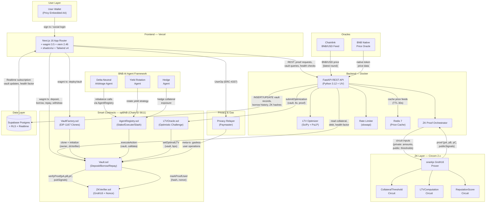
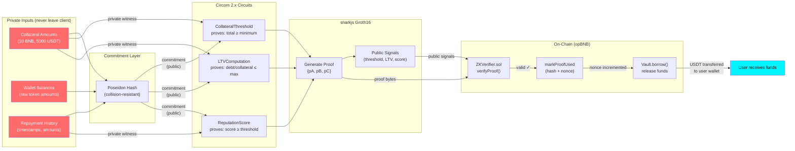
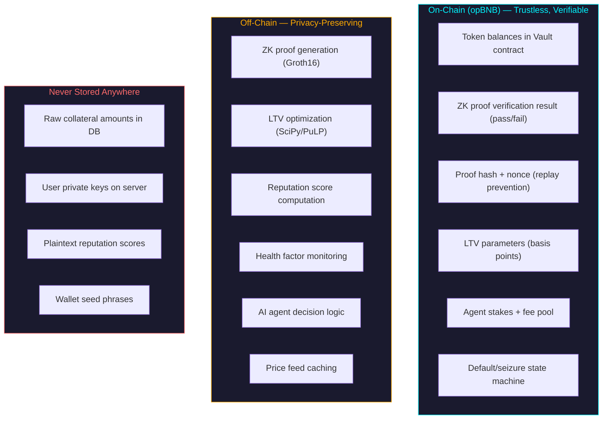
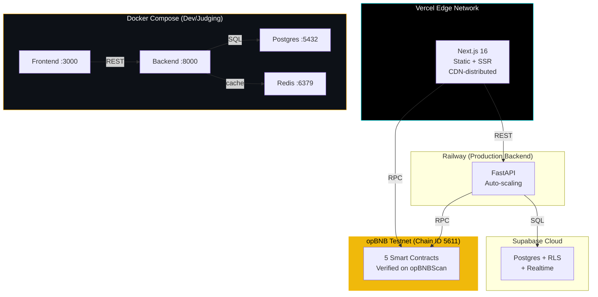

# VaultForge — System Architecture

> Complete system design showing all components, data flows, security boundaries, and deployment topology.

---

## Full System Component Diagram

Every arrow is labeled with the data or action that flows through it.

---

## ZK Proof Flow — Detailed

This diagram traces exactly how a zero-knowledge proof is created, verified, and consumed — from raw asset data to an on-chain borrow.

**Key property:** The red nodes (private inputs) never leave the user's browser. Only the proof and public signals go on-chain. The verifier contract confirms the proof is valid without learning what the actual amounts are.

---

## Data Flow Table

Every user action mapped to its on-chain effect, off-chain computation, and database update.

| Action | Who Initiates | What Happens On-Chain | What Happens Off-Chain | Database Update |
|---|---|---|---|---|
| **Connect Wallet** | User (via Privy) | — | Privy creates/loads embedded AA wallet; session JWT issued | `INSERT INTO users (wallet, auth_provider, created_at)` |
| **Deploy Vault** | User (first visit) | `VaultFactory.deployVault()` emits `VaultDeployed` event; EIP-1167 proxy created | Frontend reads event, extracts vault address | `INSERT INTO vaults (user_id, vault_address, chain_id, status)` |
| **Deposit Collateral** | User | `Vault.deposit(token, amount)` — ERC-20 transferred to vault contract | Frontend computes Poseidon hash of balance for ZK commitment | `UPDATE vault_positions SET collateral_hash = $hash, updated_at = now()` |
| **Request LTV Optimization** | AI Agent (via Backend) | `LTVOracle.submitOptimization(vault, ltv, proof)` — starts challenge window | Backend runs SciPy/PuLP optimization on portfolio composition | `INSERT INTO ltv_optimizations (vault, proposed_ltv, status, expires_at)` |
| **Challenge Optimization** | Any observer | `LTVOracle.challengeOptimization(id, counterProof)` — resets LTV | Backend validates counter-proof, recalculates | `UPDATE ltv_optimizations SET status = 'challenged'` |
| **Finalize LTV** | Backend (after window) | `LTVOracle.finalizeOptimization(id)` — LTV locked on-chain | Backend confirms no challenges in window | `UPDATE ltv_optimizations SET status = 'finalized'` |
| **Generate ZK Proof** | User (click "Borrow") | — | snarkjs Groth16 prover runs CollateralThreshold + LTVComputation circuits | `INSERT INTO proof_requests (vault, circuit, status, created_at)` |
| **Borrow** | User | `Vault.borrow(token, amount, pA, pB, pC, pubSignals)` — ZKVerifier validates, nonce incremented, tokens transferred | Backend logs tx hash, updates health factor | `INSERT INTO borrows (vault, token, amount, proof_hash, tx_hash, status)` |
| **Monitor Health** | AI Agent (continuous) | `Vault.getCollateral()` + `getDebt()` read calls (no gas) | Backend computes health factor from Chainlink price + on-chain state | `UPDATE vault_health SET health_factor = $hf, checked_at = now()` |
| **Agent Rebalance** | AI Agent | `AgentRegistry.executeAction(vault, rebalanceCalldata)` | Agent decides rebalance strategy (delta-neutral, yield rotation, hedge) | `INSERT INTO agent_actions (agent, vault, action_type, tx_hash)` |
| **Repay Debt** | User | `Vault.repay(token, amount)` — tokens transferred from user to vault, debt reduced | Backend updates health factor, reputation score | `UPDATE borrows SET status = 'repaid'; UPDATE reputation_scores SET score_hash = $new` |
| **Withdraw Collateral** | User | `Vault.withdraw(token, amount)` — tokens returned (only if no debt) | Frontend updates displayed balances | `UPDATE vault_positions SET collateral_hash = $new_hash` |
| **Trigger Default** | Anyone (if debt > 0) | `Vault.triggerDefault(token)` — marks position as defaulted | Backend alerts user, logs default | `UPDATE borrows SET status = 'defaulted'` |
| **Seize Collateral** | Anyone (after default) | `Vault.seize(token)` — max 50% of collateral seized (partial seizure) | Backend logs seizure, updates insurance pool stats | `INSERT INTO seizures (vault, token, amount_seized, penalty)` |
| **Register AI Agent** | Agent operator | `AgentRegistry.registerAgent()` — 0.01 BNB staked | Backend tracks agent registration | `INSERT INTO agents (address, owner, stake, status)` |
| **Slash Agent** | Admin | `AgentRegistry.slash(agent, amount)` — stake reduced | Backend logs slashing event | `UPDATE agents SET stake = stake - $amount, slashed = true` |
| **Update Reputation** | Backend (after repay) | — | snarkjs generates ReputationScore proof (off-chain) | `UPDATE reputation_scores SET score_hash = $hash, updated_at = now()` |

---

## Security Model

### What VaultForge Never Sees

| Secret | Where It Lives | Who Has Access |
|---|---|---|
| **User private keys** | Privy's secure enclave (HSM) or user's hardware wallet | User only — never touches VaultForge servers |
| **Raw collateral amounts** | User's browser (ephemeral, during proof generation) | User only — discarded after ZK proof is built |
| **Wallet seed phrases** | User's device / Privy infrastructure | User only — VaultForge has zero access |
| **Authentication secrets** | Privy infrastructure | Privy only — VaultForge receives JWT, never raw auth data |

### What's Stored Where

| Data | Storage Location | Format | Access Control |
|---|---|---|---|
| **Collateral positions** | Supabase Postgres | **Poseidon hash only** — never plaintext amounts | RLS: user can only read own rows |
| **Borrow records** | Supabase Postgres | Amount + token + proof hash + tx hash | RLS: user can only read own rows |
| **ZK proofs (used)** | opBNB on-chain (`ZKVerifier.sol`) | Proof hash stored in `isProofUsed` mapping | Public (but hash reveals nothing) |
| **Vault nonces** | opBNB on-chain (`ZKVerifier.sol`) | Incrementing uint256 per vault | Public (replay prevention counter) |
| **LTV optimizations** | opBNB on-chain (`LTVOracle.sol`) | LTV in basis points + optimization ID | Public (protocol transparency) |
| **Health factor history** | Supabase Postgres | Computed ratio (no raw amounts) | RLS: user can only read own rows |
| **Reputation scores** | Supabase Postgres | **ZK hash only** — raw score never stored | RLS: user can only read own rows |
| **Price feeds** | Redis (30s TTL) | Chainlink price integer | Backend-only, ephemeral cache |
| **Agent actions** | Supabase Postgres | Action type + tx hash (no vault amounts) | RLS: agent owner reads own actions |
| **User sessions** | Privy infrastructure | JWT with wallet address claim | Privy manages; VaultForge validates JWT signature |

### On-Chain vs Off-Chain Boundary

### Security Invariants (Enforced by Smart Contracts)

| Invariant | Enforced By | Mechanism |
|---|---|---|
| **No borrow without valid ZK proof** | `Vault.sol` → `ZKVerifier.sol` | `borrow()` calls `verifyProof()` — reverts if invalid |
| **No proof replay** | `ZKVerifier.sol` | `isProofUsed[hash]` mapping + per-vault nonce counter |
| **Partial seizure only** | `Vault.sol` | `MAX_SEIZURE_RATIO = 50%` — contract enforces ceiling |
| **One vault per user** | `VaultFactory.sol` | `userVaults[owner] != address(0)` check; reverts on duplicate |
| **Non-reentrant on all state changes** | All 5 contracts | OpenZeppelin `ReentrancyGuard` on every external mutating function |
| **Agent must be staked** | `AgentRegistry.sol` | `MIN_STAKE = 0.01 BNB` required to register; slashable |
| **LTV within bounds** | `LTVOracle.sol` | `MIN_LTV_BPS = 1000` (10%), `MAX_LTV_BPS = 9000` (90%) |
| **Challenge window before LTV finalization** | `LTVOracle.sol` | 1-hour window (testnet); anyone can challenge with counter-proof |
| **Owner-only withdrawals** | `Vault.sol` | `onlyOwner` modifier — only vault creator can withdraw collateral |
| **No withdrawal with outstanding debt** | `Vault.sol` | `withdraw()` reverts if `getDebt(token) > 0` |

### Trust Assumptions

| Component | Trust Level | Justification |
|---|---|---|
| **opBNB L2** | Trust BNB Chain validators | Standard L2 trust model; fraud proofs in development |
| **Chainlink price feeds** | Trust Chainlink oracles | Industry standard; decentralized oracle network |
| **Privy auth** | Trust Privy infrastructure | SOC 2 certified; keys in HSM enclaves |
| **snarkjs Groth16** | Trust trusted setup ceremony | Using Hermez `powersOfTau28_hez_final_14` (community ceremony) |
| **VaultForge backend** | Minimize trust via ZK | Backend never sees raw amounts; ZK proofs are verified on-chain, not by backend |
| **AI agents** | Minimized trust via staking + slashing | Agents post 0.01 BNB bond; admin can slash for misbehavior |
| **Supabase** | Trust Supabase infra + RLS | RLS policies enforced at database level; service key never in frontend |

---

## Deployment Topology

| Environment | Frontend | Backend | Database | Contracts |
|---|---|---|---|---|
| **Local Dev** | `npm run dev` (:3000) | `uvicorn --reload` (:8000) | Docker Postgres (:5432) | Foundry Anvil (local fork) |
| **Docker Judging** | `docker compose up` (:3000) | Same compose (:8000) | Same compose (:5432) | opBNB Testnet |
| **Production** | Vercel Edge (CDN) | Railway (auto-scale) | Supabase Cloud | opBNB Mainnet |
