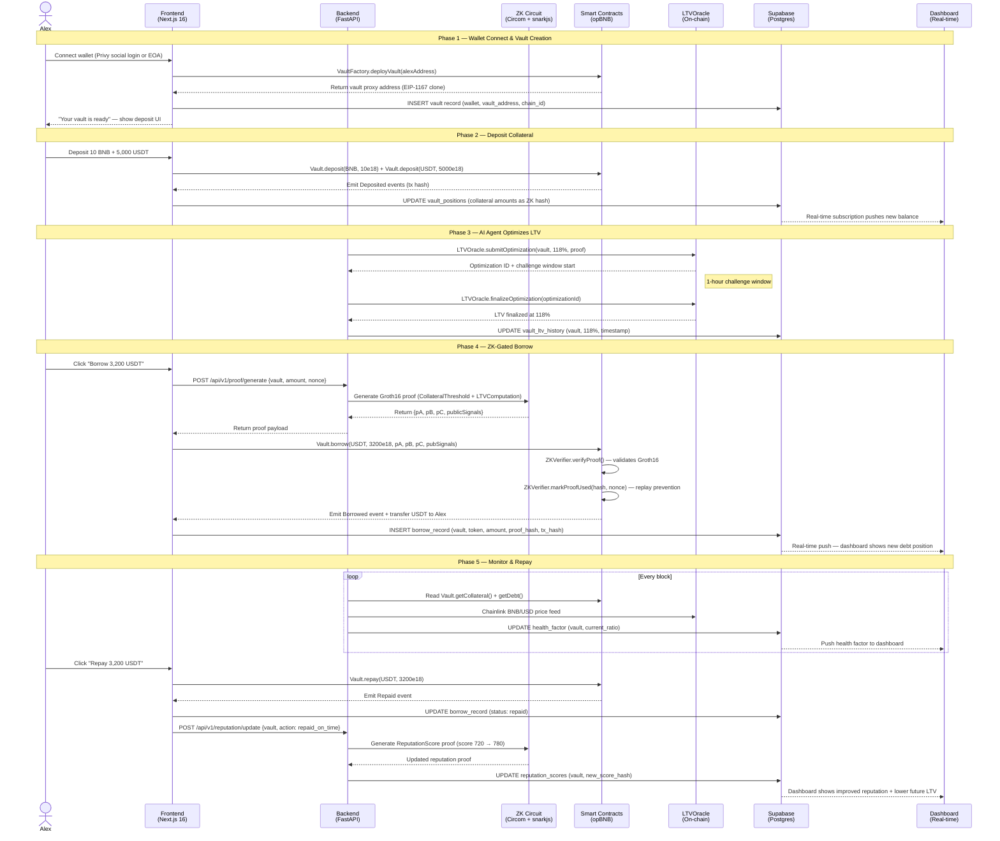
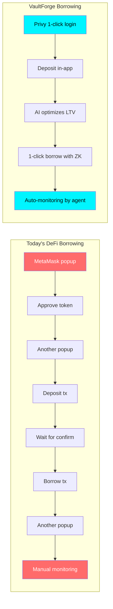

# VaultForge — User Journey

> Full flow chart showing interactions and improved UX vs existing DeFi lending tools.

---

## Alex's Complete Journey Through VaultForge

---

## Transaction Flow — Sequence Diagram

Every borrow request touches 7 system layers. This diagram traces the exact call path from Alex clicking "Borrow" to funds arriving in his wallet.

---

## A Day in Alex's Life — Before vs After VaultForge

### Without VaultForge (Today's DeFi)

| Time | What Alex Does | Pain Point |
|---|---|---|
| 9:00 AM | Needs $3,000 for laptop | Has $15k in BNB but doesn't want to sell |
| 9:15 AM | Opens Venus Finance | Must deposit $4,500+ (150% collateralization) |
| 9:20 AM | Deposits collateral | **Entire position visible on-chain** — MEV bots see liquidation price |
| 9:25 AM | Borrows $3,000 USDT | Static LTV, no optimization — capital sitting idle |
| 10:00 AM | BNB drops 10% | No alerts. No auto-rebalance. Liquidation risk climbing. |
| 11:00 AM | Panic checks position | Manually adds more collateral to avoid liquidation |
| 2:00 PM | Wants to buy laptop | No BNPL option — must bridge to fiat manually via CEX |
| 3:00 PM | Repays loan | No reputation benefit. Next loan? Same 150% requirement. |
| **Total time wasted** | **~4 hours** | **Capital locked: $4,500 for $3,000 loan (67% utilization)** |

### With VaultForge

| Time | What Alex Does | Improvement |
|---|---|---|
| 9:00 AM | Needs $3,000 for laptop | Opens VaultForge on phone |
| 9:02 AM | Connects via Privy (Google login) | **No seed phrase needed** — embedded AA wallet |
| 9:03 AM | Deposits $3,500 collateral | **Only 118% collateral** (AI-optimized LTV) |
| 9:04 AM | ZK proof generated in-browser | **Position is private** — no one sees amounts on-chain |
| 9:05 AM | 3,000 USDT in wallet | Borrowed in 3 clicks, 5 minutes total |
| 10:00 AM | BNB drops 10% | **AI agent auto-rebalances** — Alex gets push notification, no action needed |
| 2:00 PM | Buys laptop | **BNPL checkout** — 4 installments, collateral-backed, 0.1% fee |
| 3:00 PM | Repays over 4 weeks | **Reputation score increases** — next loan at 112% LTV |
| **Total time** | **~5 minutes** | **Capital locked: $3,500 for $3,000 loan (86% utilization)** |

### Key Improvements

| Metric | Without VaultForge | With VaultForge | Improvement |
|---|---|---|---|
| Collateralization ratio | 150%+ | 110–130% | **~25% less capital locked** |
| Position privacy | ❌ Fully public | ✅ ZK-private | **100% private** |
| Liquidation management | Manual panic | AI auto-rebalance | **Zero manual intervention** |
| Time to borrow | 15–30 minutes | 5 minutes | **6x faster** |
| Reputation benefit | None | Progressive LTV improvement | **Better terms over time** |
| BNPL availability | None | Native collateral-backed | **New capability** |

---

## Core User Personas

### 1. Alex — Crypto-Native Developer (Primary)

| Attribute | Detail |
|---|---|
| **Age** | 28 |
| **Occupation** | Full-stack developer at a Web3 startup |
| **Crypto Holdings** | $30,000–$100,000 in BNB, ETH, USDT across 3 wallets |
| **Goal** | Access liquidity without selling holdings or revealing positions |
| **Current Pain** | Venus/Aave requires 150%+ collateral, publicly doxxes position sizes, no automated management |
| **VaultForge Value** | ZK-private borrowing at 110–130% LTV, AI-managed vault, progressive reputation rewards |
| **Technical Comfort** | High — understands ZK proofs, gas optimization, smart contract interactions |
| **Borrowing Frequency** | 2–3 times per month for living expenses, hardware, travel |
| **Activation Trigger** | Sees 25% capital efficiency gain and privacy feature in hackathon demo |

**Alex's Story:** Alex holds 15 BNB ($4,500) and needs $3,000 for a new MacBook. On Venus, he'd lock up $4,500+ and his liquidation level would be visible to every MEV bot on BSC. With VaultForge, he deposits $3,500, generates a ZK proof privately, borrows $3,000 in under 5 minutes, and uses BNPL to pay in 4 installments. His AI agent auto-rebalances when BNB dips, and after repayment, his reputation score qualifies him for even better rates.

---

### 2. Sarah — Startup Founder Using Treasury

| Attribute | Detail |
|---|---|
| **Age** | 34 |
| **Occupation** | Founder/CEO of a BNB Chain gaming studio |
| **Crypto Holdings** | $200,000–$1M in project treasury (BNB, BUSD, project tokens) |
| **Goal** | Borrow against idle treasury for runway extension without selling project tokens at a discount |
| **Current Pain** | Selling treasury tokens signals weakness to community; OTC deals take weeks and have slippage |
| **VaultForge Value** | Non-custodial institutional vault, ZK-private treasury size, AI agent manages risk 24/7 |
| **Technical Comfort** | Medium — relies on CTO for smart contract interactions, uses UIs |
| **Borrowing Frequency** | Monthly for payroll bridge, quarterly for marketing campaigns |
| **Activation Trigger** | Board requires non-custodial solution; VaultForge's AI management removes ops burden |

**Sarah's Story:** Sarah's gaming studio has $500k in treasury but needs $150k for a 3-month marketing push. Selling project tokens would tank the price and spook token holders. With VaultForge, she deposits treasury assets into a DAO-controlled vault, borrows at AI-optimized LTV without revealing treasury size publicly, and repays from game revenue over 90 days. The AI agent automatically hedges token price exposure.

---

### 3. Omar — Global South User Underserved by TradFi

| Attribute | Detail |
|---|---|
| **Age** | 23 |
| **Occupation** | Freelance graphic designer, paid in crypto |
| **Location** | Lagos, Nigeria |
| **Crypto Holdings** | $2,000–$10,000 in BNB and stablecoins (primary savings) |
| **Goal** | Access Buy Now Pay Later for electronics, courses, and tools — no credit card, no bank credit score |
| **Current Pain** | Traditional BNPL (Klarna, Afterpay) unavailable in his region; bank requires 2-year credit history he doesn't have |
| **VaultForge Value** | Crypto-collateral BNPL with ZK reputation proof replacing traditional credit scores |
| **Technical Comfort** | Low-medium — uses mobile wallet, understands basic DeFi via YouTube |
| **Borrowing Frequency** | 1–2 times per month for equipment, software subscriptions, online courses |
| **Activation Trigger** | Friend shows him BNPL checkout that works with his existing BNB balance |

**Omar's Story:** Omar earns $2,000/month freelancing and gets paid in USDT. He wants a $500 drawing tablet but can't get BNPL from Klarna (not available in Nigeria) or a credit card (no credit history). With VaultForge, he deposits $600 in USDT collateral, generates a ZK reputation proof from his 6-month on-chain payment history, and checks out with 4 interest-free installments. As he repays consistently, his reputation score grows and his required collateral drops — building decentralized credit history that follows him across protocols.

---

## UX Improvements Over Existing Tools

| UX Metric | Venus / Aave | VaultForge | How |
|---|---|---|---|
| **Wallet popups to borrow** | 4–6 popups | 1 popup (AA batched) | Privy Account Abstraction batches approve+deposit+borrow |
| **Time to first borrow** | 15–30 min | <5 min | Embedded wallet, no seed phrase, AI handles optimization |
| **Gas cost awareness** | User pays, unpredictable | Estimated upfront, optional gasless | Paymaster relayer abstracts gas on opBNB |
| **Position monitoring** | Manual (Zapper/DeBank) | Automated AI + push alerts | AI agent watches every block, auto-rebalances |
| **Mobile experience** | Poor (MetaMask mobile) | Native-quality (Privy embedded) | Social login, biometric confirm, responsive UI |
| **Learning curve** | High (understand LTV, gas, slippage) | Low (deposit → borrow → done) | AI handles LTV; ZK is invisible to user |
